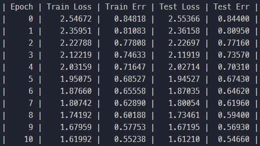

# Pitorch
The first AI framewrok designed by myself, which is the final project of class "Programming in Artificial Intelligence"

## Usage
### installation
```
conda create -n pitorch python=3.9
conda activate pitorch
# install pytorch according to your cuda version.
# (We just use torch.utils.cpp_extension to conveniently bind cuda code to python, and not utilize torch to conduct any operation)
cd lib
python setup.py develop
```
### running demo
Here I present how to use my framework to conduct classification on Minist 
```
dataset 
cd pitorch
python test_optimizer.py
```
And here is the training log:
<div align=center></div>
